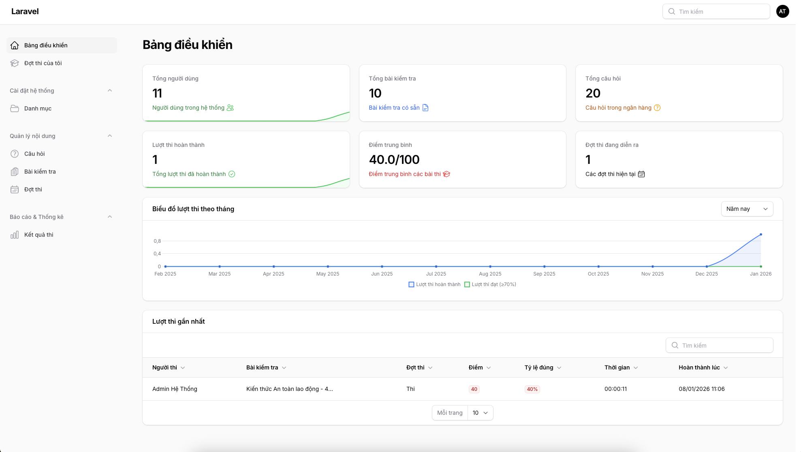
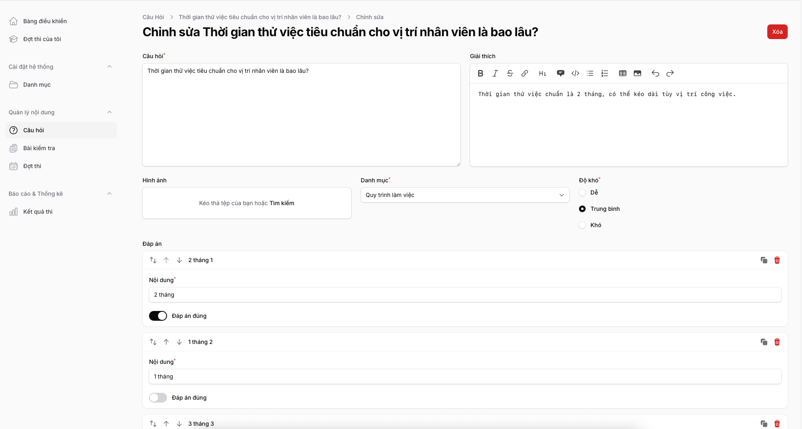
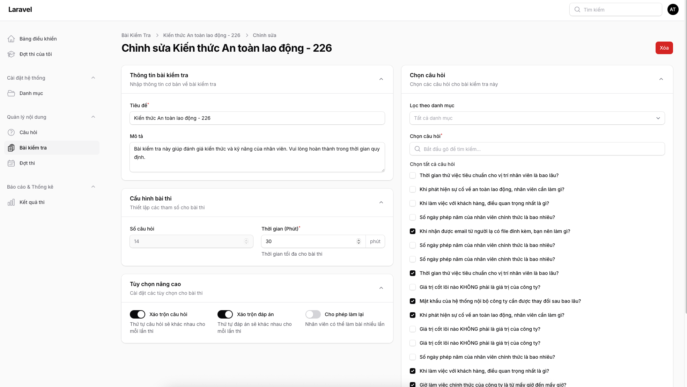
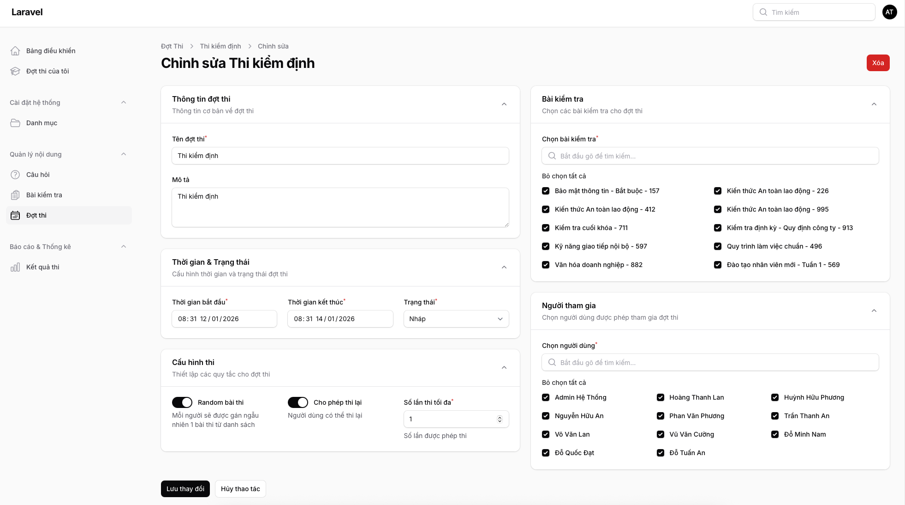
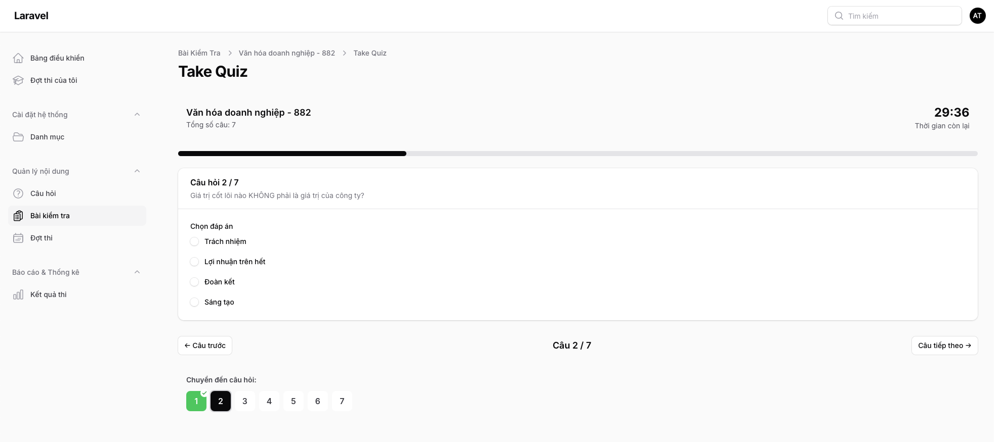
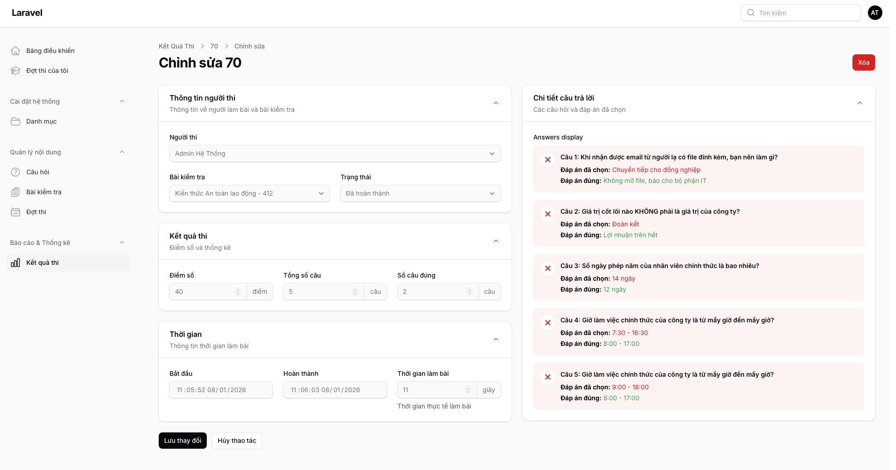

# 📚 Quiz Management System

> Hệ thống quản lý bài kiểm tra trực tuyến được xây dựng với Laravel 12, Filament v4, Livewire 3 và Tailwind CSS 4



## 📋 Mục lục

- [Giới thiệu](#-giới-thiệu)
- [Tính năng](#-tính-năng)
- [Công nghệ sử dụng](#-công-nghệ-sử-dụng)
- [Cấu trúc ứng dụng](#-cấu-trúc-ứng-dụng)
- [Cài đặt](#-cài-đặt)
- [Hướng dẫn sử dụng](#-hướng-dẫn-sử-dụng)
- [Screenshots](#-screenshots)
- [Kiến trúc & Logic](#-kiến-trúc--logic)

## 🎯 Giới thiệu

Quiz Management System là một ứng dụng web toàn diện cho phép quản lý và thực hiện các bài kiểm tra trực tuyến. Hệ thống được thiết kế đặc biệt cho môi trường đào tạo doanh nghiệp với khả năng tổ chức đợt thi, phân công người tham gia, và theo dõi kết quả chi tiết.

### Đặc điểm nổi bật

- ✅ **Admin Panel** mạnh mẽ được xây dựng với Filament v4
- ✅ **Real-time** updates với Livewire 3
- ✅ **Modern UI** với Tailwind CSS 4
- ✅ **Quản lý đợt thi** với random quiz assignment
- ✅ **Dashboard thống kê** trực quan với charts
- ✅ **Timer countdown** cho bài thi
- ✅ **Hỗ trợ tiếng Việt** đầy đủ

## ✨ Tính năng

### 🎓 Quản lý nội dung
- **Danh mục (Categories)**: Phân loại câu hỏi và bài kiểm tra
- **Ngân hàng câu hỏi (Questions)**: Tạo và quản lý câu hỏi trắc nghiệm
  - Hỗ trợ nhiều đáp án
  - Đánh dấu đáp án đúng
  - Phân loại theo danh mục
- **Bài kiểm tra (Quizzes)**: Tạo bài kiểm tra từ ngân hàng câu hỏi
  - Chọn nhiều câu hỏi
  - Cấu hình thời gian làm bài
  - Xáo trộn câu hỏi/đáp án
  - Cho phép làm lại
  - Giới hạn số lần thử

### 📅 Quản lý đợt thi (Exam Sessions)
- Tạo và lên lịch đợt thi
- Phân công người tham gia
- Gán nhiều bài kiểm tra
- Random quiz assignment cho mỗi user
- Theo dõi số lượt thi của từng người
- Cho phép thi lại (tuỳ chọn)
- Giới hạn số lần thi tối đa

### 📊 Thống kê & Báo cáo
- **Dashboard**: 
  - Tổng quan hệ thống (users, quizzes, questions)
  - Biểu đồ lượt thi theo thời gian
  - 10 lượt thi gần nhất
- **Kết quả chi tiết**:
  - Điểm số và tỷ lệ đúng
  - Thời gian hoàn thành
  - Xem lại câu trả lời (đúng/sai)
  - Lịch sử làm bài

### 👤 Trải nghiệm người dùng
- Giao diện thi trực quan với timer
- Phân trang câu hỏi
- Navigation nhanh giữa các câu
- Auto-save câu trả lời
- Modal xác nhận nộp bài
- Dark mode support

## 🛠 Công nghệ sử dụng

### Backend
- **Laravel 12** - PHP Framework
- **PHP 8.3** - Programming Language
- **SQLite** - Database

### Frontend & UI
- **Filament v4** - Admin Panel Builder
- **Livewire 3** - Full-stack Framework
- **Tailwind CSS 4** - Utility-first CSS
- **Alpine.js** - Lightweight JavaScript
- **Chart.js** - Data Visualization

### Testing
- **Pest v4** - Testing Framework
- **PHPUnit 12** - Unit Testing

### Code Quality
- **Laravel Pint** - Code Style Fixer

## 📁 Cấu trúc ứng dụng

```
quiz/
├── app/
│   ├── Filament/
│   │   ├── Pages/
│   │   │   └── ExamPage.php              # Trang đợt thi của user
│   │   ├── Resources/
│   │   │   ├── Categories/               # CRUD Categories
│   │   │   ├── Questions/                # CRUD Questions
│   │   │   ├── Quizzes/                  # CRUD Quizzes
│   │   │   │   └── Pages/
│   │   │   │       └── TakeQuiz.php      # Trang làm bài thi
│   │   │   ├── QuizAttempts/             # Xem kết quả thi
│   │   │   └── ExamSessions/             # CRUD Exam Sessions
│   │   │       ├── RelationManagers/
│   │   │       │   └── QuizAttemptsRelationManager.php
│   │   │       ├── Schemas/
│   │   │       │   ├── ExamSessionForm.php
│   │   │       │   └── ExamSessionsTable.php
│   │   └── Widgets/
│   │       ├── QuizStatsOverview.php     # Stats cards
│   │       ├── QuizAttemptsChart.php     # Line chart
│   │       └── LatestQuizAttempts.php    # Table widget
│   └── Models/
│       ├── Category.php
│       ├── Question.php
│       ├── Quiz.php
│       ├── QuizAttempt.php
│       ├── ExamSession.php
│       └── User.php
├── database/
│   ├── migrations/
│   │   ├── create_categories_table.php
│   │   ├── create_questions_table.php
│   │   ├── create_quizzes_table.php
│   │   ├── create_question_quiz_table.php
│   │   ├── create_quiz_attempts_table.php
│   │   ├── create_exam_sessions_table.php
│   │   ├── create_exam_session_user_table.php
│   │   └── create_exam_session_quiz_table.php
│   ├── factories/
│   │   ├── CategoryFactory.php
│   │   ├── QuestionFactory.php
│   │   └── QuizFactory.php
│   └── seeders/
│       └── DatabaseSeeder.php
└── resources/
    └── views/
        └── filament/
            ├── pages/
            │   └── exam-page.blade.php
            └── resources/quizzes/pages/
                └── take-quiz.blade.php
```

## 🚀 Cài đặt

### Yêu cầu hệ thống
- PHP >= 8.3
- Composer
- Node.js >= 18
- NPM hoặc Bun

### Các bước cài đặt

1. **Clone repository**
```bash
git clone <repository-url>
cd quiz
```

2. **Cài đặt dependencies**
```bash
composer install
npm install  # hoặc bun install
```

3. **Cấu hình môi trường**
```bash
cp .env.example .env
php artisan key:generate
```

4. **Tạo database**
```bash
touch database/database.sqlite
```

5. **Chạy migrations và seeders**
```bash
php artisan migrate --seed
```

6. **Tạo user admin**
```bash
php artisan make:filament-user
```

7. **Build assets**
```bash
npm run build  # hoặc bun run build
```

8. **Khởi động server**
```bash
php artisan serve
# hoặc
composer run dev
```

9. **Truy cập ứng dụng**
- Admin Panel: `http://localhost:8000/admin`
- Login với thông tin admin vừa tạo

## 📖 Hướng dẫn sử dụng

### 1️⃣ Tạo ngân hàng câu hỏi

1. Vào **Cài đặt hệ thống** → **Danh mục**
2. Tạo các danh mục (VD: Laravel, PHP, Database)
3. Vào **Quản lý nội dung** → **Câu hỏi**
4. Thêm câu hỏi mới:
   - Nhập câu hỏi
   - Chọn danh mục
   - Thêm các đáp án (tối thiểu 2)
   - Đánh dấu đáp án đúng



### 2️⃣ Tạo bài kiểm tra

1. Vào **Quản lý nội dung** → **Bài kiểm tra**
2. Click **Tạo mới**
3. Điền thông tin:
   - Tiêu đề và mô tả
   - Thời gian làm bài (phút)
   - Cấu hình: xáo trộn câu hỏi/đáp án, cho phép làm lại
4. Chọn câu hỏi từ ngân hàng
5. Lưu bài kiểm tra



### 3️⃣ Tạo đợt thi

1. Vào **Quản lý nội dung** → **Đợt thi**
2. Click **Tạo mới**
3. Cấu hình đợt thi:
   - **Thông tin cơ bản**: Tên, mô tả
   - **Thời gian**: Ngày bắt đầu/kết thúc
   - **Trạng thái**: Draft/Active/Completed/Cancelled
   - **Cấu hình**:
     - Random đề thi: Mỗi user nhận 1 quiz ngẫu nhiên
     - Cho phép thi lại
     - Số lần thi tối đa
4. Chọn bài kiểm tra (có thể chọn nhiều)
5. Chọn người tham gia
6. Lưu đợt thi



### 4️⃣ Người dùng làm bài thi

1. User đăng nhập và vào **Đợt thi của tôi**
2. Xem thông tin đợt thi:
   - Thời gian bắt đầu/kết thúc
   - Số lượt thi đã dùng/tối đa
   - Số bài thi
3. Click **Bắt đầu thi**
4. Hệ thống tự động:
   - Gán quiz (random nếu được cấu hình)
   - Bắt đầu đếm giờ
   - Tạo quiz attempt
5. Làm bài:
   - Chọn đáp án cho mỗi câu hỏi
   - Tự động lưu câu trả lời
   - Dùng navigation để chuyển câu
   - Click **Nộp bài** khi hoàn thành



### 5️⃣ Xem kết quả

1. Sau khi nộp bài, hệ thống tự động chấm điểm
2. Vào **Quản lý nội dung** → **Kết quả thi**
3. Click vào 1 kết quả để xem chi tiết:
   - Điểm số và tỷ lệ đúng
   - Thời gian hoàn thành
   - Từng câu hỏi với đáp án đã chọn
   - Đánh dấu đúng/sai
   - Hiển thị đáp án đúng cho câu sai



### 6️⃣ Xem thống kê Dashboard

Dashboard hiển thị:
- **6 Stats Cards**:
  - Tổng người dùng
  - Tổng bài kiểm tra
  - Tổng câu hỏi
  - Lượt thi hoàn thành
  - Điểm trung bình
  - Đợt thi đang diễn ra
- **Line Chart**: Biểu đồ lượt thi theo thời gian (filter: 7 ngày/30 ngày/năm)
- **Table Widget**: 10 lượt thi gần nhất


## 🏗 Kiến trúc & Logic

### Database Schema

```
┌─────────────┐      ┌──────────────┐      ┌─────────────┐
│  categories │      │   questions  │      │   quizzes   │
├─────────────┤      ├──────────────┤      ├─────────────┤
│ id          │◄────┐│ id           │┌────►│ id          │
│ name        │     ││ category_id  ││     │ title       │
│ description │     │├──────────────┤│     │ description │
└─────────────┘     │└──────────────┘│     │ time_limit  │
                    │                │     │ ...         │
                    │                │     └─────────────┘
                    │                │            │
                    │                │            │ many-to-many
                    │                │            ▼
                    │                │     ┌──────────────┐
                    │                └─────┤question_quiz │
                    │                      ├──────────────┤
                    │                      │ quiz_id      │
                    │                      │ question_id  │
                    │                      │ order        │
                    │                      └──────────────┘
                    │
                    │
┌─────────────┐     │     ┌──────────────┐      ┌─────────────────┐
│    users    │     │     │exam_sessions │      │ quiz_attempts   │
├─────────────┤     │     ├──────────────┤      ├─────────────────┤
│ id          │◄────┼────►│ id           │◄────►│ id              │
│ name        │     │     │ name         │      │ user_id         │
│ email       │     │     │ start_date   │      │ quiz_id         │
└─────────────┘     │     │ end_date     │      │ exam_session_id │
       │            │     │ status       │      │ score           │
       │            │     │ ...          │      │ correct_answers │
       │            │     └──────────────┘      │ total_questions │
       │            │            │              │ answers (JSON)  │
       │            │            │              │ started_at      │
       │            │            │              │ completed_at    │
       │            │     many-to-many          │ time_taken      │
       │            │            │              │ status          │
       │            │            ▼              └─────────────────┘
       │            │  ┌──────────────────┐
       │            │  │exam_session_user │
       │            │  ├──────────────────┤
       │            └─►│ exam_session_id  │
       │               │ user_id          │
       └──────────────►│ attempts_used    │
                       │ assigned_quiz_id │
                       └──────────────────┘
                              │
                       ┌──────────────────┐
                       │exam_session_quiz │
                       ├──────────────────┤
                       │ exam_session_id  │
                       │ quiz_id          │
                       └──────────────────┘
```

### Workflow chính

#### 1. Admin tạo nội dung
```
Admin → Tạo Categories → Tạo Questions → Tạo Quizzes (chọn Questions)
```

#### 2. Admin tổ chức đợt thi
```
Admin → Tạo Exam Session → Chọn Quizzes → Chọn Users → Active
```

#### 3. User làm bài thi
```
User Login 
  → Vào "Đợt thi của tôi"
  → Click "Bắt đầu thi"
  → Hệ thống kiểm tra:
     ✓ Đợt thi còn active?
     ✓ User được phân công?
     ✓ Còn lượt thi?
  → Gán Quiz (random nếu cấu hình)
  → Tạo QuizAttempt (status: in_progress)
  → Hiển thị trang TakeQuiz với Timer
  → User chọn đáp án (auto-save)
  → User nộp bài
  → Hệ thống chấm điểm tự động
  → Update QuizAttempt (status: completed)
  → Tăng attempts_used
  → Hiển thị kết quả
```

#### 4. Xem thống kê
```
Dashboard Widgets:
  → QuizStatsOverview: Aggregate data từ tất cả models
  → QuizAttemptsChart: Group by date với filter
  → LatestQuizAttempts: Latest 10 completed attempts
```

### Key Components

#### 1. Filament Resources
- **CategoryResource**: CRUD đơn giản
- **QuestionResource**: Form với Builder field cho options
- **QuizResource**: 
  - Form: CheckboxList chọn questions
  - Custom page: TakeQuiz (Livewire component)
- **QuizAttemptResource**: 
  - Read-only
  - Custom display cho answers JSON
- **ExamSessionResource**:
  - Form: Grid layout, CheckboxList cho quizzes & users
  - Table: Badges, counts, filters
  - Relation Manager: QuizAttemptsRelationManager

#### 2. Livewire Components
- **TakeQuiz Page**:
  - Properties: `$attempt`, `$questions`, `$currentQuestionIndex`, `$timeRemaining`
  - Methods: `mount()`, `nextQuestion()`, `previousQuestion()`, `submitQuiz()`
  - Real-time: Auto-save answers, countdown timer
  - Modal: Confirmation trước khi submit

#### 3. Filament Widgets
- **StatsOverviewWidget**: 6 stat cards với mini charts
- **ChartWidget**: Line chart với filters
- **TableWidget**: Eloquent query với pagination

### Security & Best Practices

✅ **Authorization**: Policies cho mỗi model  
✅ **Validation**: Form Requests cho tất cả inputs  
✅ **N+1 Prevention**: Eager loading relationships  
✅ **Database Transactions**: Khi tạo/update nhiều records  
✅ **Soft Deletes**: Không xóa vĩnh viễn data quan trọng  
✅ **Timestamps**: Tracking created_at, updated_at  
✅ **Indexes**: Database indexes cho performance  
✅ **Type Hints**: Strict typing trong PHP 8.3  
✅ **Code Style**: Laravel Pint formatting  

## 🧪 Testing

Chạy tests:
```bash
php artisan test
```

Chạy Pint:
```bash
vendor/bin/pint
```

## 📝 License

This project is open-sourced software licensed under the [MIT license](https://opensource.org/licenses/MIT).

## 🤝 Contributing

Contributions, issues and feature requests are welcome!

## 👨‍💻 Author

**Your Name**
- GitHub: [@yourusername](https://github.com/yourusername)
- Email: your.email@example.com

## 🙏 Acknowledgments

- [Laravel](https://laravel.com)
- [Filament](https://filamentphp.com)
- [Livewire](https://livewire.laravel.com)
- [Tailwind CSS](https://tailwindcss.com)


In order to ensure that the Laravel community is welcoming to all, please review and abide by the [Code of Conduct](https://laravel.com/docs/contributions#code-of-conduct).

## Security Vulnerabilities

If you discover a security vulnerability within Laravel, please send an e-mail to Taylor Otwell via [taylor@laravel.com](mailto:taylor@laravel.com). All security vulnerabilities will be promptly addressed.

## License

The Laravel framework is open-sourced software licensed under the [MIT license](https://opensource.org/licenses/MIT).
